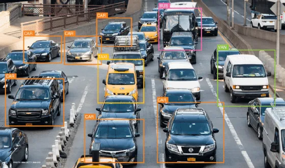
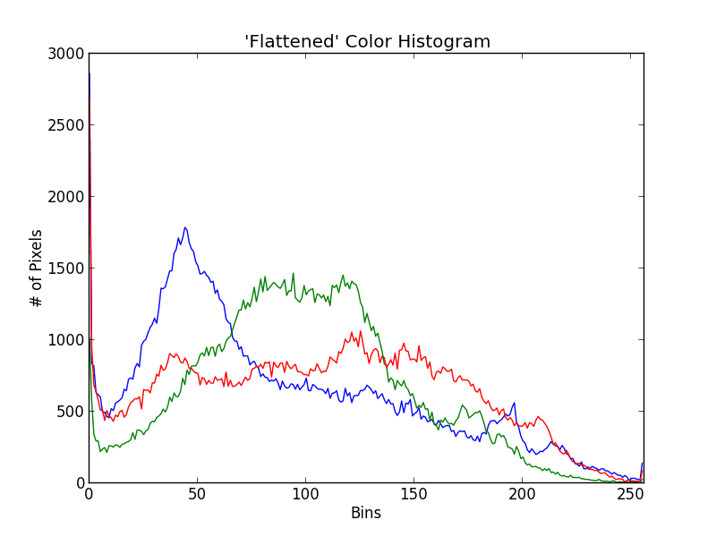

## Hvorfor studere Computer Vision?

- CV er vidt anvendt i industrien, bl.a. i robotics, embedded og spilindustrien
- For bedre at forstå computergrafik generelt
- Det er et af de få felter i software der både er gammelt og stadig i rivende udvikling

## Portefølje krav

* Eksempler på porteføljer (gennemgås på tavlen, ligger også på ItsLearning under resourcer)
* Eneste forskel fra eksempler er at krav er minimum 1 use case, og skal handle om object recognition/detection eller segmentering
* I skal selv finde en use case i vil arbejde med, og få det godkendt af underviser. Det skal gøres hurtigst muligt, og i kan regne med det kræver lidt justering inden godkendelse.

## Vurderingsgrundlag

* Valg af billeder 
    * Niveau 1: Der er fundet/taget billeder der indeholder det relevante objekt.
    * Niveau 2: Billederne viser det relevante objekt fra en replikérbar vinkel og belysning. Der er eksperimenteret med forskellige lyssætninger, vinkler og størrelser (såvidt det er relevant for den valgte use case).
    * Niveau 3: Billederne er i belysning der kan vises at være typiske forhold der kan kontrolleres i virkeligheden. F.eks. hvis det er fra et produktionsapparat er belysning og vinkling af billeder som det ville være muligt i den virkelige opsætning.

* Anvendelse af filtre til at forstærke elementer i billedet der hjælper med segmentering/detektion
    * Niveau 1: Korrekt, enkelt anvendelse af farve/lysfiltre og thresholding.
    * Niveau 2: Blur, edge detection, anvendt korrekt og med en dokumenteret proces der viser forbedring.
    * Niveau 3: Flere relevante filtre anvendt i sekvens til use case, med proces der viser forbedring over flere iterationer, med forklaringer på hvorfor de er anvendt og brugbare til use case, og med reflektion over hvorfor dem der ikke er anvendt ikke ville fungere.

* Bred anvendelse 
    * Niveau 1: Anvendte filtre og segmentering/detektionsalgoritme virker nogenlunde på ét billede.
    * Niveau 2: Pipeline virker nogenlunde pålideligt på flere positive billeder i samme forhold (lys, vinkel etc.)
    * Niveau 3: Pipeline segmenterer/detektere pålideligt flere positive billeder, og på negative billeder er der korrekt ikke segmenteret eller detekteret noget. Med andre ord, bevis du kan detekterere/segmentere objektet, og bevis du ikke fejlagtigt detektere irrelevante objekter.

* Brug af segmenterings/detektionsalgoritme
    * Niveau 1: Der er fundet frem til en algoritme der virker fint efter finjustering af parametre
    * Niveau 2: Der er vist en process af parameterjustering, og forklaret hvorfor der er skiftet parametre. Eksperimentering på flere billeder.
    * Niveau 3: Der er sammenlignet flere segmenterings/detektionsalgoritmer der er relevante til use case, og processen med Eksperimentering er dokumenteret. Der er vurderet hvad styrker/svagheder ved hver algoritme er.

### Hvad er ikke med i vurderingsgrundlag?

* Matematik. Der er mange formler i de forskellige links, men dem kan i ignorere hvis det ikke hjælper jer.
* Præcision, i hvert fald i en vis udstrækning. Såvidt jeres endelige pipeline indeholder metoder der alle bidrager til use case, giver de credit.
* Om i selv har taget billeder eller fundet dem. Så længe billedkvaliteten er god og de er realistiske/repræsentative til formålet er det godt.
* Hvilket sprog i har valgt. Brug hvad i føler jeg mest komfortabel med. Skal dog nævnes at hvis i vil rode med machine learning, så er Python bestemt. 
* Kompleksiteten af metoderne. Det vigtigste er at metoderne er relevante og bidrager til løsningen.

---

## Liste og forklaring af typer af teknikker

* Til inspiration
* [https://opencv.org/blog/top-computer-vision-projects/](https://opencv.org/blog/top-computer-vision-projects/)
* Disse teknikker kan alle danne grundlag for jeres use case

## Object recognition/detection



---

## Forklaring

* Kunne identificere et objekt i et billede
	* Sige hvilket dyr vi har at gøre med (tænk vildtreservater)
	* Skelne biler og cykler (tænk selvkørende biler eller trafikoptælling)
    * Skraldesortering (skelne metal og plasticobjekter f.eks.)

---

## Real world use cases der bruger object recognition

* Optælling
* Nummerpladeaflæsning (identificér bogstaver)
* Autonome køretøjer (identificér biler, cykler, skilte)
* Sortering af objekter

---

## Segmentering

* Pixels der kontekstuelt hænger sammen bliver kategoriseret
	* F.eks. sammenhængende blå pixels = himmel
	* Finde objekter vha. deres kanter og omrids f.eks.
* Læs for cases og dybere forklaring: https://www.gdsonline.tech/3-types-of-image-segmentation/

---

## Opgave 0 - Segmentering vs object recognition

* Sammenlign begge teknikker. Find endeligt ekstra materialer og visualiseringer.
* Er der forskel på hvilke use cases vi tackler? Find eksempler.
* Hvilken metode finder du mest intuitiv? Hvorfor?

---

## Eksamensinfo

* Aflevering af portefølje Onsdag den 21. klokken 23:59
* Mundtlig prøve 22. - 10 minutter oplæg 10 minutter spørgsmål
* Karakterer kommer senere, da det er en helhedsvurdering og skal nå at gennemse porteføljer ordentligt
* 80/20 ratio på vurdering af portefølje/mundtlig præstation.

---
## Hvad er et "godt billede" i computer vision?

- Høj kontrast - god linse og hardware er ikke nok
- Lav forvrængning - en tripod kan være vigtig
- Nok lys - det meste vi ser er reflektioner
- Høj opløsning - for lavt og kanter er svære at finde, mindre farverig også
- Ikke meget støj - støj gør det svært at finde kanter eller se detaljer 
- I skal bruge disse kriterier i følgende opgave...

---

## Opgave 0 - Billeder og portefølge

* I løbet af i dag og i morgen skal i vælge en use case til jeres portefølje og få den godkendt af underviser
* Du har nu ½ time til at diskutere med kammerater om use cases og begynde at vælge et
* Det er ikke bindende før du godkender ét med underviser - under alle omstændigheder skal vi bruge et use case så i kan begynde at anvende teknikker på jeres egne billeder i dag
* Find mindst 3 forskellige, relevante billeder til jeres use case. Brug regler fra sidste slide til at vurdere jeres billeders egnethed

---

## Dagens tema: Billeder og farverum

* Hvordan er billeder bygget op?
* Hvordan kan billeder repræsenteres i forskellige farverum?
	* Hvad er de primære forskelle på at arbejde i de forskellige farverum?


---
## Pixels og billeder - deres repræsentation - Gråskala



---
## Gråskala forklaret

* I gråskala er billeder repræsenteret som en 2D tabel af integers
* Hvert integer repræsenterer **intensiteten** (lysstyrken) af den pågældende pixel

---

## Gråskala kode - Python

```python
import cv2
img = cv2.imread('image.jpg') # Load image
gray_img = cv2.cvtColor(img, cv2.COLOR_BGR2GRAY) # Convert to gray
cv2.imshow('Grayscale', gray_img)
cv2.waitKey(0)
cv2.destroyAllWindows()
```

---

## Gråskala kode - C++

```cpp
#include <opencv2/opencv.hpp>
using namespace cv;
std::string image_path = "macaw.jpg";
int main() {
	Mat image = imread(image_path);
	Mat grayImage;
	cvtColor(image, grayImage, COLOR_BGR2GRAY);
	imshow("New Image", grayImage);
	waitKey();
	return 0;
}```

---
## RGB billeder

* Se et RGB billede som 3 gråskala billeder, hvor hvert af dem beskriver intensiteten af hver farve - 1 lag rød, et andet lag grøn, 3. lag blå.
* Når vi blander disse primærfarver kan vi lave de fleste farver

---

## Kodesnippet til næste opgave

Beregn gennemsnit af 1 farvekanal: 
```python
averageRed = np.average(img[:, :, 0])
```

```cpp
cv::Scalar mean = cv::mean(image);
std::cout << "Average Blue Channel Value: " << mean[0] << std::endl;
```

---
## Opgave 1: Basal analyse og arbejde på gråtone og RGB

* Find 2 farvebilleder der er relevant for din use case
* Load billederne i både gråtone og RGB
* På gråtonebillederne, beregn gennemsnittet af alle pixelværdierne
* Baseret på resultaterne kan du sige hvad gennemsnittet siger om billederne?
* På farvebillederne, gør det samme - er det det forventede snit du ser på hver kanal? Hvorfor (ikke)?

---
## Lidt mere om farver

* Mens RGB er populært, så er det sjældent specielt godt til computer vision
* Mest fordi vi skal blande farver for at skabe dem - hvilket gør det at skelne mellem farver kan være meget svært
* For let at kunne skelne mellem farver kan vi med fordel bruge HSV farveskalaen
* Lidt mere om denne om lidt

---

##  HSV

HSV har 3 kanaler, ligesom RGB også er 3 kanaler. De 3 kanaler hos RGB beskriver hver en farve, men HSV er det anderledes.
* **H** står for **hue**, går fra 0 - 180 og beskriver farven
* **S** står for **saturation**, går fra 0 - 255 og beskriver farvemætheden.
* **V** står for **value**, går fra 0- 255 og beskriver intensiteten af farven

Hvilket vil sige hvis vi bare vil have alle blå farver, kan vi filtere kun i **H**ue og deraf isolere blå farver. Dette skal vi bruge i næste opgave.

---

## HSV farveskala


---

## Video til opgave 2

Videomateriale (eksempel er med video, men alt efter cvtColor kan bruges *as-is* på ét billede) til at isolere farver i HSV billeder:

https://www.youtube.com/watch?v=aFNDh5k3SjU

---

## Opgave 2

* Filtrer en enkelt farve for at isolere et objekt i dit billede
* Tag macaw.jpg fra resourcer og prøv at find ud af hvilke værdier der skal til for at isolere hver af papegøjens farver. Alle andre pixels end den farve du ønsker at isolere skal være sort (intensitet 0).

---

## Billedhistogrammer

![[Pasted image 20241231150403.png]]

--- 

## Kode eksempler og forklaring

* Kodeeksempler (begge sprog) https://docs.opencv.org/3.4/d8/dbc/tutorial_histogram_calculation.html
* Y aksen er antallet af pixels, x aksen er intensiteter. 
* Histogrammet giver derfor en oversigt over hvor mange pixels der er af hver farve, i forskellige intensiteter. Dette giver et meget mere nuanceret overblik over billedets komposition rent farve- og lysmæssigt end gennemsnit

---
## Opgave 3 - Selvstudie

* Lav et histogram på hue-dimensionen på det samme billede, og sammenlign med RGB. Hvordan ser det ud? I hvilket farverum er det lettest at skelne mellem farver og intensiteter?
* Et histogram er ofte et godt værktøj til hjælpe med at isolerere bestemte farver og/eller intensiteter. Kan du se
* Vi diskuterer svar på Opgave 3 i morgen.
